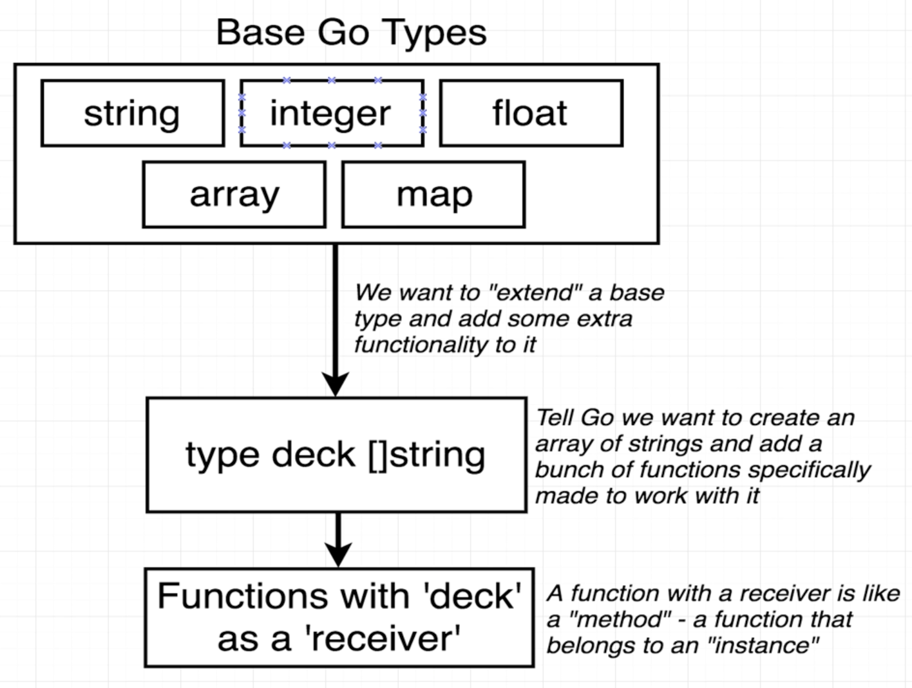
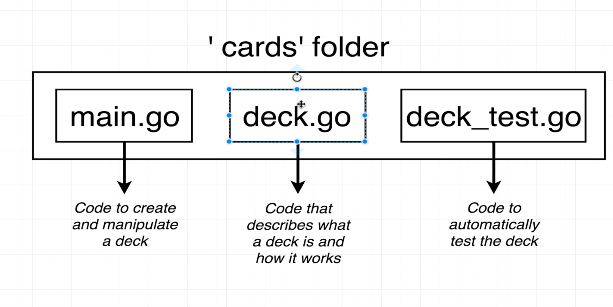
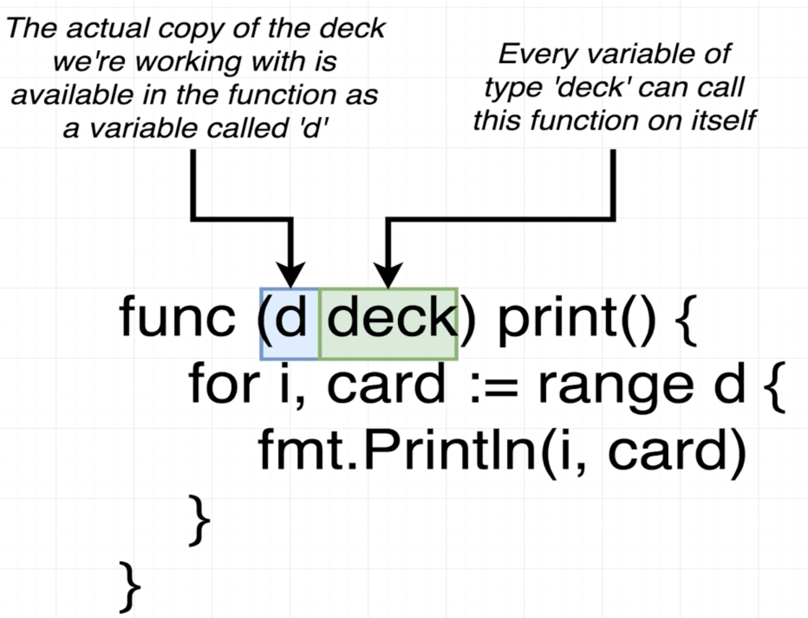
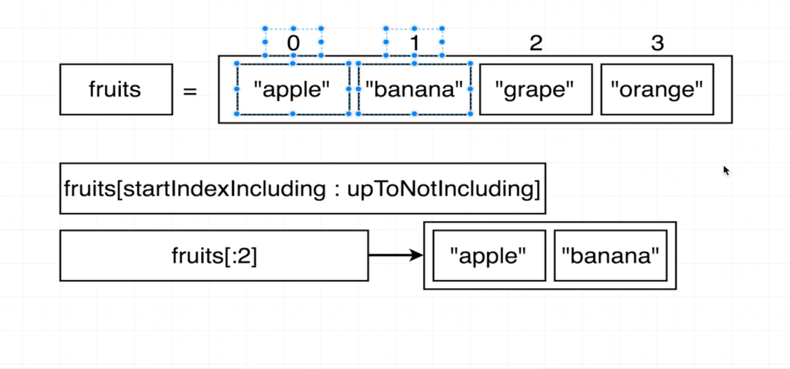

# A Cards Project #


## overview 
    - newDeck : Cretae a list of playing cards. Essentitally an array of strings
    - print : log out the contents of a deck of cards
    - shuffle : shuffles all the cards in a deck 
    - deal : Create a 'hand' of cards
    - Save to File : Save a list of cards to a file on the local machine 
    - newDeckFromFile : Load a list of cards from the local machine 

## how to declare a variable in Go?

```
 var card string = "Ace of Spades"
```
    - go is refered as statically type language 
    - so variable always gonna contain string 

```
Basic Data Types in GO 
    - bool : true, false
    - string : ""
    - int : 0, -10000, 99999
    - float64 : 10.000001, 0.00009, -100.003
    
```

## defining function in GO?

```
 func functionName() returnType {
    return value;
 }
``` 

## Arrays and Slice

    - Arrays : fixed length 
    - Slice : dynamic shrink and grow according to use

## How to add new element in Slice ?
```
	cards := []string{"Ace of Diamonds",newcard()}
    cards = append(cards,"six of Spades")
```

## How to iterate over the Slice?
```
for i, card := range cards {
		fmt.Println(i, card)
	}
```

## What does func (d deck) print() { } means?
    - Any variable of Type deck is allowed to use the print() method



## Slicing in GO 
